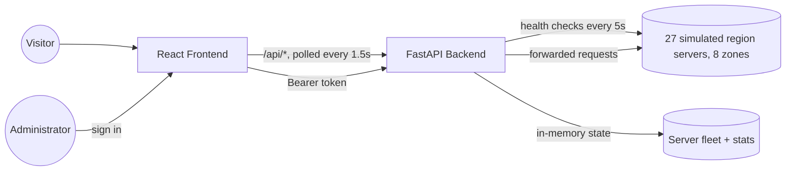
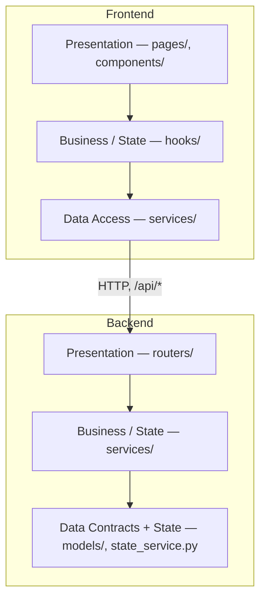

# Green-Shift

## Eco-Routing Cloud Balancer

Green-Shift began as a simple question: what if request routing decisions accounted for the carbon intensity of the electricity powering each server region, not just latency or load? The original concept sketched a lightweight demo to make that idea visible and interactive. This document folds that original concept together with the system as it was actually built, so the full arc of the project, from idea to delivered application, lives in one place.

---

## 1. Concept

Green-Shift simulates a cloud load balancer that routes incoming traffic to whichever server region currently offers the cleanest, least loaded, lowest-latency combination, and visualizes that decision on a live map. A backend service maintains a simulated global server fleet with carbon scores, load, and latency; a frontend application shows, in real time, which region is winning and why, with an admin console for observing and steering the simulation.

The founding idea rested on four pillars:

- A routing engine that picks the greener option instead of the default one.
- A visual, geographic dashboard that makes an abstract routing decision tangible.
- A running tally of the carbon saved by choosing green over default.
- A containerized setup that can be spun up and demonstrated end to end.

Everything built afterward is an elaboration of those four pillars, at a larger scale than first scoped.

## 2. What Was Built

| Pillar | Original scope | Delivered |
|---|---|---|
| Eco-routing engine | A lightweight API reading a local JSON file of mock carbon scores for two dummy regions, with simple if/else routing logic | A FastAPI service running a two-stage scoring algorithm across 8 geographic zones and 27 individual servers, combining carbon intensity, load, and latency, backed by a background health-check loop that continuously marks servers online or offline |
| Live status dashboard | A React map with two hardcoded markers (one per region) and two status cards | A full interactive world map (Leaflet + OpenStreetMap/CARTO tiles) with all 27 region markers, four visual states (active, available, unavailable, offline) with a pulsing highlight for the active region, a draggable live overview panel, a legend, and a full admin console for monitoring and control |
| Carbon savings tally | A hardcoded "savings multiplier" returned whenever a request landed on the greener region | A computed savings multiplier (a fixed baseline carbon score divided by the selected server's actual score), a running total of estimated CO2 saved, average latency, and a carbon reduction percentage, all calculated live on every request and surfaced across the dashboard and admin overview |
| Containerized infrastructure | Docker containers for frontend, backend, and two dummy region endpoints, run locally or on a single cloud VM | A Docker Compose stack with separate development and production frontend images, the backend service, 27 individually named simulated region-server containers spread across 8 zones, and a tunneling service for exposing the running demo publicly without manual cloud networking configuration |

The scope grew considerably between concept and delivery: from two hand-picked regions to a full simulated global fleet, and from a hardcoded savings figure to a genuinely computed one.

## 3. System Architecture

### 3.1 System Overview

The delivered system is three cooperating pieces: a frontend single-page application, a backend routing service, and a fleet of simulated region servers that the backend forwards (simulated) requests to.

Neither side holds a database. The backend's in-memory model is the single source of truth for anything live (carbon scores, server status, routing decisions, statistics); the frontend treats that model as authoritative and only holds its own data for one thing that doesn't change at runtime: the static map coordinates used to plot each region.

### 3.2 Layered Architecture

Both the frontend and the backend are organized the same way internally: a **layered architecture**, where each layer has one job, only talks to the layer directly below it, and never reaches back up. Neither codebase uses a heavier framework-enforced layering (no NestJS-style modules, no Django-style apps); the layering is a convention, applied consistently, not a structure the tooling forces on you.

| Layer | Responsibility | Frontend | Backend |
|---|---|---|---|
| **Presentation** | Renders the UI, or accepts HTTP requests, with no business logic of its own | `pages/`, `components/` | `routers/` (`route.py` for public endpoints, `admin.py` for admin endpoints) |
| **Business / state logic** | Owns state, decision-making, and side effects | `hooks/` (`useLiveMetrics` polling, `useAuthSessionState` session logic) | `services/` (`routing_service.py`, `health_service.py`, `stats_service.py`, `auth_service.py`) |
| **Data access / data contracts** | Frontend: shapes and sends outbound HTTP calls. Backend: defines the data contracts and holds the authoritative state | `services/` (`adminApi.ts`, `authSession.ts`, talking to the backend over `/api`) | `models/` (`schemas.py`, Pydantic request/response contracts) plus `state_service.py` (the in-memory server fleet, the single source of truth) |

The same rule governs both sides: each layer only calls into the layer beneath it, never the reverse. On the frontend, components call hooks, hooks call services, services call the backend. On the backend, routers call services, services read and write the shared state and validate against the data models. This is what keeps each layer independently testable (see `tests/frontend/liveMetrics.test.tsx`, which exercises the frontend's business layer with no rendering involved, or `backend/tests/test_routing.py`, which exercises the routing algorithm with no HTTP layer involved) and what keeps a change in one layer, e.g. swapping polling for WebSockets, or in-memory state for Redis, from rippling into layers that shouldn't need to know about it.

One naming collision worth flagging for anyone reading both codebases: the frontend's `services/` folder is its **data-access** layer (it talks to the backend), while the backend's `services/` folder is its **business-logic** layer (it holds the routing, health-check, and statistics logic). Same folder name, different layer, on either side of the API boundary.

## 4. The Experience

**Landing page.** A single public screen explaining the concept: a headline, four feature cards mirroring the four pillars above, and a button into the live dashboard.

**Live dashboard.** A full-screen interactive map where every simulated region is a marker. The currently active region pulses; available regions sit quietly on standby; regions with no live data grey out; offline regions turn red. Clicking a marker opens a detail card with that region's live carbon intensity and last routing decision. A floating, draggable overview panel keeps the active region, cumulative carbon saved, savings multiplier, API connection health, and a short history of recent region switches always in view.

**Admin console.** A login-gated management screen with four sections: an overview of headline statistics and per-region status, a region browser grouped by continent where an operator can hand-edit any server's carbon score, load, latency, or online status, a simulation runner that can fire up to 300 simulated requests at a chosen region on demand, and a settings screen with system health and a full data reset. Every mutating action requires a signed-in admin session.

Both the dashboard and the admin console poll the backend roughly every second and a half, so nothing on screen is ever more than a couple of seconds stale, and the whole experience keeps working, in a visibly degraded state rather than silently, if the backend becomes unreachable.

## 5. Under the Hood

### Technology

| Layer | Technology |
|---|---|
| Frontend framework | React 19 with TypeScript, built on Vite |
| Frontend UI | MUI, Leaflet/react-leaflet for the map, Embla for the mobile card carousel |
| Frontend routing and state | react-router, React Context plus custom hooks (no external state library) |
| Backend framework | FastAPI on Uvicorn, Python 3.10+ |
| Backend validation | Pydantic schemas for every request and response body |
| Backend HTTP client | httpx, used both for forwarding simulated requests and for health checks |
| Testing | Vitest and React Testing Library on the frontend; pytest on the backend |
| Packaging | Docker (multi-stage images) and Docker Compose for the full stack |

### Routing algorithm

Routing happens in two stages inside the backend's routing service. First, every zone with at least one online server is scored as the average carbon score plus 0.3 times the average load across its online servers, and the lowest-scoring zone wins. Second, within that zone, every online server is scored as its carbon score plus 0.6 times its load plus 0.1 times its latency, and the lowest-scoring server wins. Load is weighted heaviest at the server level deliberately: once a clean zone has been chosen, the algorithm actively spreads traffic away from whichever server in it is busiest. Every routed request nudges the winning server's load up by five points, and every fiftieth request across the whole system lets every non-selected server's load decay back down slightly, so the simulation keeps moving even without a live operator.

### Health, statistics, and authentication

A background loop pings every server every five seconds and only flips a server's status after two consecutive successes or failures in a row, which avoids the status flickering on a single transient blip. Every routed request is logged into a running statistics model that tracks total requests, per-zone and per-server counts, accumulated latency, and estimated CO2 saved against a fixed baseline; average latency and a carbon reduction percentage are derived from that model on every read and returned to the frontend live. Administrative actions (editing a server, running a simulation, resetting the system) all sit behind a bearer-token login: the frontend stores the token for the duration of a signed-in session and attaches it to every admin request.

### Testing

The backend carries a pytest suite covering the routing algorithm, the carbon score reader, in-memory state handling, statistics accumulation, and the API surface itself. The frontend carries a Vitest and Testing Library suite covering the landing page and its cards, the live metrics polling and derivation logic, the shared navigation, the theme system, and the live overview panel. The admin console and its authentication flow are the frontend's least-covered area and are the natural next place to extend the test suite.

### Deployment

The full stack runs through a single Docker Compose file: a development frontend image with hot reload, a production frontend image served through a lightweight preview server, the backend service, all 27 region-server containers (named individually and grouped by zone), and a tunneling service that exposes the running production frontend at a public URL for demonstration purposes, without needing manual cloud firewall or security-group configuration.

## 6. From Plan to Delivery

The original concept organized work into four workstreams. Each one shipped meaningfully beyond its initial scope:

| Workstream | Originally planned | Delivered |
|---|---|---|
| Backend and routing logic | A minimal API with if/else routing over two mock regions and a hardcoded savings figure | A scored, two-stage routing algorithm over 27 servers, a live health-check loop, and a full statistics engine computing real savings figures on every request |
| Frontend and UI | A UI skeleton connected to the API, with a two-marker map and a tally counter | A themed, responsive single-page application with a full 27-marker interactive map, a draggable live overview, and a complete admin console for monitoring and control |
| Data simulation and testing | Mock carbon/load JSON files and a request-flooding test collection | A seed data file feeding an in-memory model that can be edited live through the admin API, backed by a pytest suite, plus an in-app simulation runner that reproduces the same kind of load testing from inside the admin console itself |
| Infrastructure | Dockerfiles for the frontend, backend, and two dummy servers, deployed to a single cloud VM | Multi-stage Docker images, a Compose stack orchestrating the full 27-server fleet alongside the frontend and backend, and a tunneling service standing in for manual cloud deployment |

The original roadmap moved through four phases: establishing the architecture and mock data, building the core routing logic and first integration, stress-testing the system under simulated load, and finally polishing and deploying it. That sequence held up well against how the system was actually delivered, with the map integration in particular growing from a scoped-down fallback option into the centerpiece of the live dashboard.

A few risks called out early in planning were resolved differently than first assumed, which is worth recording:

| Original risk | Original mitigation plan | How it was actually resolved |
|---|---|---|
| Backend readiness blocking frontend and testing work | Prioritize the routing API early in the schedule | The routing API, health checks, and statistics engine were built as the foundation the rest of the system depends on |
| Docker networking misconfiguration between services | Define explicit network aliases and test connectivity early | Every region server runs as its own named Compose service, addressed by the backend through container-network DNS |
| Map integration being too complex for the available skill level, with a cards-only fallback in reserve | Use Leaflet with two hardcoded points and timebox the work | The map became the flagship feature and scaled cleanly from two markers to the full 27-server fleet without needing the fallback |
| Cloud deployment requiring manual network security configuration | Test exposing ports on a cloud VM ahead of the final demo | A tunneling service exposes the production frontend at a public URL directly from the container stack, sidestepping manual cloud networking entirely |
| A statically cached mock data file causing the demo to not visibly react to changes | Ensure the backend re-reads the mock file on every request | Superseded entirely: the backend keeps live state in memory and exposes it through an admin API, so changes take effect immediately without any file re-reading at all |

## 7. Visual Identity

The concept originally left branding as an open question. What was actually built settled on a simple, consistent identity: a leaf-green primary color, paired with a warm off-white surface in light mode and a near-black surface in dark mode, set in the Sora typeface throughout. The same green also marks "active" and "healthy" states everywhere in the interface, from the map's pulsing marker to the admin sidebar's connection indicator, so the color itself doubles as a piece of the product's information design rather than existing purely as decoration.

## 8. Known Limitations and Future Work

- All backend state, the server fleet and every statistic, lives in process memory and resets on restart; moving it to a persistent store would let the demo survive a redeploy without losing history.
- Authentication uses a single static, non-expiring admin token defined in source; this is appropriate for a demo but would need environment-based secrets, hashed credentials, and short-lived tokens before any production use.
- The backend currently allows only one hardcoded frontend origin through CORS and runs its container image with a development reload flag enabled, both of which would need to change for a real deployment.
- The frontend's admin console and authentication flow are not yet covered by automated tests, unlike the rest of the application.
- A dashboard link out to observability tooling exists in the admin settings screen but is not yet pointed at a real destination.
- A small development-only sandbox route exists in the frontend as a scratch page and intentionally renders nothing.

## 9. Closing

What started as a scoped-down demo, two regions, a hardcoded number, a pair of map pins, grew into a full simulated global routing system with a genuinely computed carbon model, a live 27-server interactive map, and a complete administrative control surface behind real authentication. The concept and the delivery agree on what the project is for: making an invisible infrastructure decision, routing traffic toward the cleaner option, visible and tangible. Everything built on top of that idea has been in service of showing that decision as clearly and honestly as possible.
