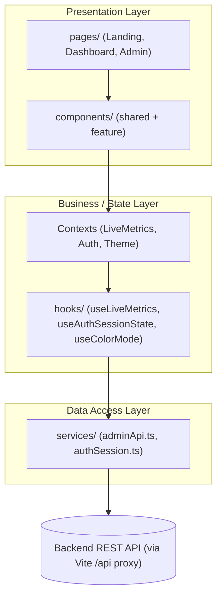
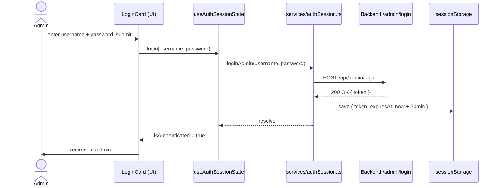
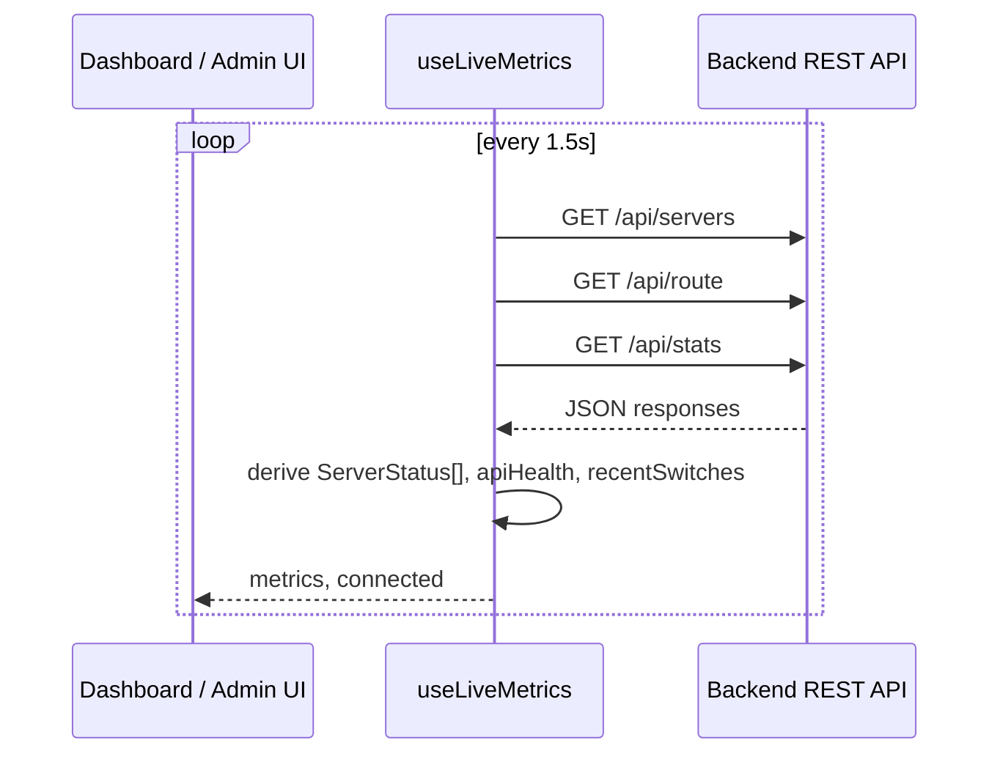

# Green-Shift - Frontend Documentation

This document describes the frontend only (`green-shift/frontend`) of Green-Shift, an "Eco-Routing Cloud Balancer" demo. It visualizes simulated web traffic being routed to whichever server region currently has the lowest carbon intensity.

It is split into two parts:

- **Part 1, Non-Technical Overview**: what the app is and does, written for anyone (product owners, QA, stakeholders) with no coding background required.
- **Part 2, Technical Documentation**: architecture, code structure, data flow, and conventions, written for developers who will read or extend the code.

---

# Part 1: Non-Technical Overview

## 1.1 What Green-Shift Is

Green-Shift is a demo application that shows how internet traffic could be routed to the data-center region with the cleanest (lowest-carbon) electricity, instead of just the nearest or least-loaded one. A backend simulates a set of regional servers with fake "carbon intensity" scores. The frontend visualizes, in real time, which region is currently receiving traffic and how much carbon is being "saved" by that choice.

It is explicitly a simplified educational demo build (see the footer text on the landing page: "Simplified demo build"). Coordinates, carbon scores, and server load are simulated, not real infrastructure data.

## 1.2 What the Frontend Does

The frontend is the visual layer of the project. It does not decide which region gets traffic; that decision is made by the backend. The frontend's role is to:

1. **Explain the concept** to a visitor (landing page).
2. **Show live routing decisions** on an interactive world map (dashboard).
3. **Let an administrator monitor and manually influence** the simulation (admin panel).

## 1.3 The Three Experiences

### Landing Page (`/`)
The public homepage. It explains the product in one screen: a headline ("Route traffic to the cleanest grid, automatically"), four feature cards describing the eco-routing engine, the live dashboard, the carbon savings tally, and the containerized demo setup, plus a button to jump into the live dashboard. It also has a light/dark mode toggle in the corner.

### Live Dashboard (`/dashboard`)
A full-screen interactive world map (built on OpenStreetMap tiles) showing every simulated server region as a marker:
- A **pulsing green marker**: the region currently receiving traffic.
- A **plain marker**: a region that's online and available but on standby.
- A **greyed-out marker**: a region the system currently has no live data for.
- A **red marker**: a region that's offline or erroring.

Clicking a marker opens a details card with that region's carbon intensity and last routing decision. A floating "Live Routing Overview" panel (draggable, and collapsible on mobile) shows the currently active region, total carbon saved, the savings multiplier, API connection health, and a short history of recent region switches. An "i" button reveals a legend explaining the marker colors.

### Admin Panel (`/admin`, behind login)
A management console with its own sidebar navigation, containing:

| Section | Purpose |
|---|---|
| **Overview** | Headline stats (total requests, regions live, carbon saved, savings multiplier), a requests-by-server breakdown, a performance summary, recent simulation history, and a grid of every tracked region. |
| **Regions** | Every region grouped by continent (Europe, Africa, Asia-Pacific, Americas), filterable by continent. Expanding a region reveals its individual servers, where an admin can **edit carbon score, current load, and latency**, and flip a server online/offline (with an "Auto Mode" button to hand control back to the backend's automated health check). |
| **Simulation** | Lets an admin fire a batch of simulated requests (up to 300 at once) at a chosen region and see the results (requests routed, resulting load), plus a button to reset all simulation data. |
| **Settings** | Links out to observability tooling (a Grafana dashboard link, currently unwired, see §1.6) and shows API health; also contains a "Danger Zone" to reset all simulation data, with a confirmation prompt. |

Access to `/admin/*` requires signing in at `/admin/login` with a username and password checked by the backend. The session lives for **30 minutes** and is stored only for the current browser tab (cleared on tab or browser close).

## 1.4 How Data Flows (Plain Language)

The dashboard and admin panel don't just load data once. They **poll the backend roughly every 1.5 seconds**, so the map, counters, and admin tables stay "live" without the page needing to be refreshed. If the backend becomes unreachable, the UI shows a "Degraded" or "Offline" API status instead of silently going stale.

## 1.5 Light and Dark Mode, Branding

The whole app supports light and dark themes, toggled via the sun/moon button and remembered between visits. The brand color is a leaf green (`#3A8005`), paired with a warm off-white in light mode and a near-black in dark mode. The app uses the "Sora" font throughout.

## 1.6 Current Limitations and Work in Progress

These are honest gaps in the current build, useful to know before demoing or planning further work:

- The **Grafana dashboard link** in Admin, Settings is present in the UI but not yet pointed at a real URL.
- There's a hidden **`/dev` sandbox page** (development builds only) that exists as a blank scratch page for trying things out; it currently renders nothing.
- The public site currently has two "front doors", the landing page and the dashboard, with the admin panel reachable from both.

## 1.7 Glossary

| Term | Meaning |
|---|---|
| **Zone / Region** | A simulated geographic cluster of servers, e.g. `eu-west`, `us-east` (named after AWS region conventions). |
| **AZ (Availability Zone)** | An individual simulated server within a region, e.g. `eu-west-1`. |
| **Carbon intensity / carbon score** | A simulated number (gCO2/kWh) representing how "dirty" a region's electricity is right now; lower is better. |
| **Savings multiplier** | How many times more efficient the eco-routing is estimated to be versus naive routing. |
| **Manual override** | A flag meaning an admin manually set a server's status, rather than the backend's automated health check controlling it. |
| **Active region** | The region currently selected to receive simulated traffic. |

---

# Part 2: Technical Documentation

## 2.1 Architecture Overview

The frontend follows a layered architecture, adapted to a React single-page application:

| Layer | Responsibility | Where it lives |
|---|---|---|
| **Presentation** | Renders screens and handles user interaction | `pages/`, `components/` |
| **Business / state logic** | Owns application state, derives view-ready data, orchestrates side effects (polling, session expiry) | `hooks/` |
| **Data access** | Talks to the backend over HTTP, shapes requests and responses | `services/` |

Each layer only depends on the layer(s) below it: components call hooks, hooks call services, services call the backend, never the other way around. This keeps the UI free of `fetch` calls and keeps the data-access layer free of any React or UI concerns, which is what makes each layer independently testable (see `tests/frontend/liveMetrics.test.tsx`, which tests the state/business layer with no rendering involved).

There is no separate client-side Model layer in the classic sense. The backend's REST API is treated as the frontend's single source of truth for anything live (carbon scores, routing decisions, stats). The one place the frontend holds its own authoritative data is static, non-live geography (`assets/leaflet/regions.ts`), a deliberate simplification for a demo rather than a true data layer.



### Design principles applied

A few established software design principles show up concretely in this codebase:

- **DRY (Don't Repeat Yourself)**: `hooks/liveMetrics.ts`'s `toLiveMetrics()` is explicitly commented as the single source of truth for shaping live data; every screen reads from it rather than re-deriving stats independently. `assets/themes/colors.ts`'s `regionMarkerStates` is the one place marker, legend, and status-dot colors are defined, so the map, the legend, and the admin panel can never disagree on what a color means.
- **KISS (Keep It Simple)**: state management is plain React Context plus hooks, not a state library, which is appropriate for an app this size at the cost of not scaling cleanly to a much larger team or app (see trade-offs below).
- **YAGNI (You Aren't Gonna Need It)**: `pages/admin/AdminSectionPlaceholder.tsx` exists as a ready-to-use "coming soon" component but isn't wired into a route until a section actually needs it, rather than pre-building placeholder routes speculatively.
- **SOLID, single responsibility**: the hook/Context split (§2.4) keeps state logic and state distribution as separate concerns. `useAuthSessionState`/`useLiveMetrics` don't know about React Context at all, and the `AuthProvider`/`LiveMetricsProvider` wrapper components don't know any auth or polling logic.

### Trade-offs made

Every architectural choice below trades one property for another:

| Choice | Gains | Costs |
|---|---|---|
| REST polling every 1.5s instead of WebSockets/SSE | Simple to build, debug, and demo; no extra backend infrastructure | Higher request volume and up to about 1.5s of staleness compared to a push-based approach |
| React Context instead of a state library (Redux/Zustand) | Fast to build for a small app, no extra dependency | Would need revisiting if the app or team grew significantly; Context re-renders more broadly than a selector-based store |
| Session token in `sessionStorage` instead of an httpOnly cookie | Simple to implement entirely on the frontend, no backend cookie handling needed | More exposed to XSS than an httpOnly cookie would be, an accepted trade-off for a demo, not a production-hardened choice |
| Static, hardcoded region coordinates on the frontend instead of fetched from the backend | Zero extra API surface, map renders instantly | Frontend and backend region lists can drift out of sync if one changes without the other |

## 2.2 Tech Stack

| Layer | Technology |
|---|---|
| Framework | React 19 (with the React Compiler enabled via Babel) |
| Language | TypeScript ~6.0 |
| Build tool | Vite 8 |
| Routing | `react-router` v8 (`BrowserRouter`) |
| UI library | MUI (`@mui/material`) v9 + Emotion |
| Mapping | `react-leaflet` v5 / Leaflet 1.9, OpenStreetMap/CARTO tiles |
| Carousel | `embla-carousel-react` (landing page cards on touch devices) |
| Testing | Vitest 4 + `@testing-library/react` + jsdom |
| Icons/assets | Inline SVG via `vite-plugin-svgr` (`?react` imports) |
| Containerization | Docker (multi-stage), Docker Compose |

## 2.3 Repository Layout

```
frontend/
├── Dockerfile                     # multi-stage: base, dev / build, prod
├── vite.config.ts                 # dev server, proxy, plugins, vitest config
├── index.html                     # shell, font preload, anti-flash theme script
├── src/
│   ├── main.tsx                   # React root, wraps App in AppThemeProvider
│   ├── App.tsx                    # BrowserRouter + all route definitions
│   ├── App.css / index.css        # global CSS, @font-face (Sora)
│   ├── assets/
│   │   ├── apiStatus.ts           # API health to label/color mapping
│   │   ├── format.ts              # NA constant + display() helper
│   │   ├── leaflet/
│   │   │   ├── leafletSetup.ts    # fixes default Leaflet marker icon paths
│   │   │   └── regions.ts         # static lat/lng data for every simulated AZ
│   │   └── themes/
│   │       ├── colors.ts          # brand/background/text color palette
│   │       ├── theme.ts           # MUI theme + custom "fluid"/"custom" tokens
│   │       ├── sharedStyles.ts    # reusable sx snippets (gradients, panels)
│   │       └── ThemeProvider.tsx  # light/dark mode context + persistence
│   ├── components/
│   │   ├── (shared) Logo, Navbar, BackButton, AdminButton, DashboardButton,
│   │   │   ThemeButton, RoundedIconButton, StatusDot, StatusPill, MetricRow
│   │   ├── Dashboard/             # Map.tsx, OverviewDetails, RegionStatus,
│   │   │                          # RegionDetailsPanel
│   │   ├── AdminPanel/            # sidebar + all admin screens + shared
│   │   │                          # admin card primitives and data helpers
│   │   └── Landing/                # LandingCards(Section/Carousel)
│   ├── hooks/
│   │   ├── liveMetrics.ts         # polling hook + Context + pure selectors
│   │   ├── LiveMetricsProvider.tsx
│   │   ├── useAuthSession.ts      # auth state hook + Context
│   │   └── AuthProvider.tsx
│   ├── services/
│   │   ├── authSession.ts         # session storage + /admin/login call
│   │   └── adminApi.ts            # authenticated admin write endpoints
│   └── pages/
│       ├── landing/, dashboard/, sandbox/   # each: Page.tsx + index.ts barrel
│       └── admin/                 # AdminPage (layout), AdminLoginPage,
│                                    # RequireAdminAuth, AdminSectionPlaceholder
└── (tests live outside this folder, at ../tests/frontend, see §2.13)
```

## 2.4 State Management and Data Layer

The app uses one recurring pattern for shared state: a plain hook holding the state, paired with a thin Provider component that puts it on a Context. This appears twice:

- `hooks/useAuthSession.ts` (`useAuthSessionState` + `AuthContext`/`useAuthContext`) pairs with `hooks/AuthProvider.tsx` (`AuthProvider`)
- `hooks/liveMetrics.ts` (`useLiveMetrics` + `LiveMetricsContext`/`useLiveMetricsContext`) pairs with `hooks/LiveMetricsProvider.tsx` (`LiveMetricsProvider`)

This keeps the stateful logic testable and reusable independently of the Context plumbing.

### Auth state
- `useAuthSessionState` initializes `isAuthenticated` from `isSessionValid()` and re-checks every **15 seconds** via `setInterval`, so an expired session is detected without a page reload.
- `login(username, password)` calls `loginAdmin` (in `services/authSession.ts`), which POSTs to `${API_BASE}/admin/login` and stores `{ token, expiresAt }` in `sessionStorage` under `gs_admin_session`, with a **30-minute** expiry (`SESSION_DURATION_MS`).
- `logout()` clears `sessionStorage`.
- `AuthProvider` wraps `/admin/login` and everything under `/admin` in `App.tsx`. `RequireAdminAuth` (`pages/admin/RequireAdminAuth.tsx`) redirects unauthenticated visitors to `/admin/login`, remembering where they came from via router `state`.



### Live metrics (dashboard and admin data)
`hooks/liveMetrics.ts` is the single source of truth for turning raw backend responses into UI-ready data (explicitly commented as such in the code). Key pieces:

- `useLiveMetrics()` polls three endpoints every **1.5 seconds** (`POLL_INTERVAL_MS`) in parallel: `GET /servers`, `GET /route`, `GET /stats`. It tracks connection state (`connected`) and derives `apiHealth` (`healthy` / `degraded` / `offline`) from fetch failures, non-OK responses, and offline server counts.
- `serversFromCarbonResponse()` flattens the backend's `{ zones: { zoneName: { serverId: {...} } } }` shape into a flat `ServerStatus[]` array the UI consumes everywhere.
- `onlineAzCountByRegion()` and `regionAverages()` are pure aggregation helpers used by the Admin Regions/Overview screens.
- Route switches are tracked client-side: whenever the backend's `selected_zone` changes between polls, a timestamped entry is pushed onto a rolling list (max 5, `MAX_RECENT_SWITCHES`) shown in the "Recent Switches" / "Recent Simulations" UI.
- `LiveMetricsProvider` is mounted once, inside `AdminPage`, so every admin sub-route shares one polling loop via `useLiveMetricsContext()`. The `DashboardPage` instead calls `useLiveMetrics()` directly, its own independent polling loop, not shared with the admin panel since the two are never mounted together.



### Theme state
`assets/themes/ThemeProvider.tsx` (`AppThemeProvider`) holds `mode: 'light' | 'dark'` in React state, persists it to `localStorage` under `themeMode`, and builds the MUI theme via `createTheme(getDesignTokens(mode))`. It's mounted once in `main.tsx`, outside the router, so theme is available everywhere including the 404 redirect. `index.html` contains a small inline script that reads `themeMode` from `localStorage` before React mounts, to avoid a flash of the wrong background color.

## 2.5 API Integration Layer

- `API_BASE = '/api'` (defined in `hooks/liveMetrics.ts` and re-exported/imported by `services/*.ts`). All frontend fetches go through this relative path.
- In dev (`vite dev`) and preview (`vite preview`) modes, Vite's dev-server proxy (`vite.config.ts`) rewrites `/api/*` to `API_PROXY_TARGET` (defaulting to `http://127.0.0.1:8000`, overridden by the `API_PROXY_TARGET` env var in Docker Compose to point at the `backend` service) and strips the `/api` prefix.
- **Public, unauthenticated endpoints** (polled by `useLiveMetrics`):
  - `GET /servers` returns per-zone/server carbon score, load, latency, status, last-selected timestamp, and manual-override flag.
  - `GET /route` returns the current routing decision plus cumulative carbon saved and savings multiplier.
  - `GET /stats` returns total requests, per-zone/per-server request counts, average latency, and carbon reduction %.
- **Admin endpoints** (`services/adminApi.ts`), all requiring `Authorization: Bearer <token>` via `authHeaders()` (throws if no session token is present):
  - `POST /admin/login` (in `authSession.ts`, not `adminApi.ts`; it's the one call made before a token exists)
  - `POST /admin/simulate` `{ count, zone }`
  - `POST /admin/reset`
  - `PATCH /admin/carbon-score` `{ zone, server, carbon_score }`
  - `PATCH /admin/load` `{ zone, server, current_load }`
  - `PATCH /admin/latency` `{ zone, server, latency }`
  - `PATCH /admin/status` `{ zone, server, status }`
  - `POST /admin/release-override` `{ zone, server, status }`, hands a server back to automatic health-check control ("Auto Mode" in the UI).
- Error handling is minimal and consistent: failed `fetch`/non-OK responses throw, and calling UI code catches them to show an inline error string (e.g. `AdminSimulation`, `AdminSettings`) rather than using a global error boundary or toast system.

## 2.6 Routing and Access Control

Defined entirely in `src/App.tsx`:

| Path | Element | Notes |
|---|---|---|
| `/dev` | `SandboxPage` | Only registered when `import.meta.env.DEV` is true (dev builds only) |
| `/` | `LandingPage` | Public |
| `/dashboard` | `DashboardPage` | Public, no auth |
| `/admin/login` | `AdminLoginPage` | Wrapped in `AuthProvider`; redirects to `/admin` (or the original destination) if already authenticated |
| `/admin` | `RequireAdminAuth<AdminPage>` | Layout route; redirects to `/admin/login` if not authenticated |
| `/admin` (index) | `AdminOverview` | |
| `/admin/regions` | `AdminRegions` | |
| `/admin/simulation` | `AdminSimulation` | |
| `/admin/settings` | `AdminSettings` | |
| `*` | `Navigate to="/"` | Catch-all |

`pages/admin/AdminSectionPlaceholder.tsx` exists as a generic "coming soon" fallback component but isn't currently wired into a route.

## 2.7 Theming System

`assets/themes/theme.ts` augments MUI's `Theme`/`ThemeOptions` types (via TypeScript module augmentation) with two custom token groups, both consumed through `useTheme()` everywhere in the codebase:

- **`theme.fluid`**: responsive sizing values built with CSS `clamp(min, preferred, max)`, e.g. `edgeOffset`, `navbarHeight`, `sidebarWidth` (fixed `280px`), text sizes, CTA button dimensions. This is how the app achieves fluid typography and spacing without breakpoint-by-breakpoint overrides for every value.
- **`theme.custom`**: mode-dependent design values that aren't plain MUI palette colors, such as map tile URL (different CARTO basemap per mode), admin sidebar background/border/muted-text colors, card shadows, and the navbar's gradient border. Each is defined once per mode inside `getDesignTokens(mode)`.

`assets/themes/colors.ts` is the flat source-of-truth palette (`BrandColors`, `BackgroundColors`, `TextColors`, `shadows`) plus `regionMarkerStates`, a fixed record that maps each of `active`, `available`, `unavailable`, and `offline` to a `fill` and `stroke` color, used by both the map markers and every "status dot" in the UI, so marker, legend, and badge colors can never drift out of sync.

`assets/themes/sharedStyles.ts` exports reusable `sx`-producing functions (`gradientBorderSx`, `gradientTopBarSx`, `floatingPanelSx`) so the navbar, admin sidebar, and floating dashboard panels share the same gradient-border/glassy-panel treatment instead of duplicating the CSS.

Styling throughout the codebase is done via MUI's `sx` prop directly on components; there are no separate CSS Modules or styled-component files per component. `cardStyles.ts` (Admin Panel only) is the one place where a handful of shared `sx` object factories are centralized for the admin cards/pages.

## 2.8 Component Architecture

### Shared (`src/components/`)
Small, reusable, presentational: `Logo` (swaps SVG per theme mode), `Navbar` (public pages), `RoundedIconButton` (base for `BackButton`/`AdminButton`/`ThemeButton`/`DashboardButton`), `StatusDot`, `StatusPill`, `MetricRow` (label/value row used across overview panels).

### `components/Dashboard/`
- **`Map.tsx`** (`RegionMap`): the Leaflet map. Builds one `L.divIcon` per marker state up front (`MARKER_ICONS`), derives each region's visual state via `stateForRegion()` (matches live server data to static region coordinates), and renders a `RegionDetailsPanel` positioned relative to the clicked marker using `MapPanelSync` (a child component that uses `useMap()`/`useMapEvents()` to recompute screen position on pan/zoom, and auto-closes the panel if it would render fully off-screen).
- **`OverviewDetails.tsx`**: the draggable "Live Routing Overview" floating panel (pointer-event based dragging, position persisted to `localStorage`), plus an expandable `RegionStatus` legend.
- **`RegionDetailsPanel.tsx`**: the per-region popup card shown on marker click.
- **`RegionStatus.tsx`**: the marker-color legend.

### `components/AdminPanel/`
- **`AdminNavbar.tsx`**: sidebar (desktop) / drawer (mobile) navigation; shows live API connection status via `useLiveMetricsContext()`.
- **`AdminOverview.tsx`, `AdminRegions.tsx`, `AdminSimulation.tsx`, `AdminSettings.tsx`**: the four admin screens (see §1.3 for behavior).
- **Shared admin primitives**: `AdminPageHeader`, `StatCard`, `FilterPill`, `LoginCard`, `LogoutButton`, `RequestsByServer`, `PerformancePanel`, `RecentSimulations`, `AllRegionsGrid`, `cardStyles.ts`.
- **Pure data helpers** (no React): `regionCatalog.ts` (derives a deduplicated `{ id, location, azCount }[]` from the static `regions.ts` AZ list; this is not fetched from the backend, it's computed from frontend-local coordinate data), `continents.ts` (region-id prefix to continent), `regionStatus.ts` (`deriveRegionStatus`: online AZ count versus total, mapped to marker state and label).

### `components/Landing/`
`LandingCardsSection` picks between a static flex-wrap grid (desktop/pointer devices) and `LandingCardsCarousel` (Embla-powered, autoplay every 4s, touch devices) based on `useMediaQuery('(pointer: fine)')`. `LandingCards` is the individual feature card.

## 2.9 Pages (`src/pages/`)

Each page folder follows the same barrel pattern: a `*Page.tsx` plus an `index.ts` that re-exports it as the default, so page imports elsewhere read as `import X from '../pages/x'`.

- `landing/LandingPage.tsx`: see §1.3. Uses a `ResizeObserver` to size the text block above the feature cards to exactly match the cards grid's rendered width.
- `dashboard/DashboardPage.tsx`: composes `Navbar`, `OverviewDetails`, and `RegionMap`; owns the mobile "show overview" toggle state.
- `admin/AdminPage.tsx`: the admin layout shell (sidebar + `<Outlet/>`), wraps everything in `LiveMetricsProvider`.
- `admin/AdminLoginPage.tsx`, `admin/RequireAdminAuth.tsx`: see §2.6.
- `sandbox/SandboxPage.tsx`: an intentionally empty scratch page, only routed in dev builds (§1.6).

## 2.10 Map Integration (Leaflet)

- `assets/leaflet/regions.ts`: hand-picked, hardcoded lat/lng for each simulated availability zone, loosely modeled on real AWS region naming and geography but with **randomized coordinates within the relevant country**, not real data-center locations. Several AZs are commented out (kept for reference/future expansion).
- `assets/leaflet/leafletSetup.ts`: works around a known Leaflet and bundler issue where the default marker icon path resolution breaks; re-points it at the bundled marker PNGs. Imported once in `main.tsx`.
- Marker state (`active` / `available` / `unavailable` / `offline`) is computed per-render in `Map.tsx` by matching each static region entry against the live `ServerStatus[]` from `useLiveMetrics`; a region with no matching live server is `unavailable` rather than assumed offline.

## 2.11 Build Tooling and Configuration

- **`vite.config.ts`**: registers `@vitejs/plugin-react`, the React Compiler via `@rolldown/plugin-babel` (`reactCompilerPreset()`, which trades some dev/build performance for compiler-driven memoization), and `vite-plugin-svgr` (enables `import Icon from './x.svg?react'`). Defines the `/api` proxy (shared by `server.proxy` and `preview.proxy`) and the Vitest config block (`environment: 'jsdom'`, globals on, setup/spec files resolved from `../tests/frontend`).
- **TypeScript**: `tsconfig.app.json` targets ES2023, bundler module resolution, strict unused-locals/params checks, `noEmit` (Vite handles emission).
- **ESLint**: flat config (`eslint.config.js`) combining `@eslint/js` recommended, `typescript-eslint` recommended, `eslint-plugin-react-hooks`, and `eslint-plugin-react-refresh` (Vite-aware fast-refresh rule).

## 2.12 Testing

- Framework: **Vitest** + **React Testing Library** + **jsdom**, configured inside `vite.config.ts`'s `test` block.
- Notably, test files live **outside** the `frontend/` folder, at the repo-root `tests/frontend/` (sibling to `tests/backend/`), not colocated with source. This keeps frontend and backend tests under one top-level `tests/` directory. `vite.config.ts`'s `test.include`/`test.setupFiles` point there with relative (`../tests/frontend/...`) paths.
- Current coverage: `App`, `BackButton`, `LandingCards`, `LandingCardsSection`, `LandingPage`, `liveMetrics` (the polling/selector hook, part of the business layer described in §2.1, and it can run without rendering anything because the hook has no direct MUI/DOM dependency of its own), `Navbar`, `OverviewDetails`, `ThemeButton`, `ThemeProvider`.
- npm scripts: `npm run test` (single run, `vitest run`) and `npm run test:watch` (`vitest`).

## 2.13 Build and Deployment

**`Dockerfile`** (multi-stage, Node 20 slim):
| Stage | Purpose | Exposed port | Command |
|---|---|---|---|
| `base` | installs deps, copies source | none | none |
| `dev` | hot-reload dev server | `5173` | `npm run dev -- --host 0.0.0.0` |
| `build` | production build (`tsc -b && vite build`) | none | none |
| `prod` | serves the built output | `4173` | `npm run preview -- --host 0.0.0.0` |

**`docker-compose.yml`** (repo root) defines, among other services:
- `backend`: FastAPI/Flask backend on `:8000`.
- `frontend`: production stage, `:4173`, `API_PROXY_TARGET=http://backend:8000`.
- `frontend-dev`: dev stage, `:5173`, source bind-mounted for live editing (`node_modules` kept as an anonymous volume to avoid host/container mismatch).
- roughly 27 dummy per-AZ "region server" containers (`eu-west-1`, `us-east-2`, etc.), each built from `./server` with `SERVER_NAME`/`ZONE` env vars; these are what the backend's `/servers` endpoint reports on, and what the frontend's map/admin panel visualize.
- `ngrok`: tunnels the production `frontend` service (`:4173`) out to a fixed public URL for demoing; requires `NGROK_AUTHTOKEN` (kept in the repo-root `.env` and treated as a secret, not reproduced in this document).

**Environment variables consumed by the frontend build/runtime**:
- `API_PROXY_TARGET`: where `/api/*` is proxied to (dev/preview only; not used in a static production deploy without a server-side proxy in front).

## 2.14 Conventions Observed

Useful to know before extending the codebase, since they're consistent but not written down elsewhere:

- **Styling**: always MUI `sx` props with the `theme.fluid`/`theme.custom` tokens; no CSS Modules, no styled-components, no Tailwind. Shared style logic is extracted as plain functions returning `SxProps<Theme>` (`sharedStyles.ts`, `cardStyles.ts`), not as reusable styled components.
- **State sharing**: the "hook holds state, thin Provider wraps it in Context" split (§2.4) is the established pattern for any new cross-cutting state; follow it rather than introducing a state library.
- **Barrel pages**: every page folder gets a `PageName.tsx` + `index.ts` re-export pair.
- **Region/server terminology**: "zone" and "region" are used interchangeably for the group (e.g. `eu-west`); an individual member is a "server" or "AZ" (e.g. `eu-west-1`). `regionCatalog.ts`/`continents.ts`/`regionStatus.ts` are the canonical places for zone-level derived data; prefer extending those over recomputing similar logic in a component.
- **`N/A` display**: `assets/format.ts`'s `display()`/`NA` is the standard way null/undefined metric values are rendered, used consistently instead of ad hoc `?? '-'` checks.
- **No toast/global error system**: async failures are surfaced as local component state (`error`/`setError`) rendered inline, not through a shared notification system.
- **Inline code comments**: most comments in the codebase are short, plain-English notes on non-obvious behavior (e.g. why a value stays hardcoded, or what a data shape represents).

## 2.15 Known Gaps and TODOs (Technical)

- `AdminSettings.tsx`: `GRAFANA_URL = ''`, the "View Grafana" action pill has no destination yet.
- `pages/sandbox/SandboxPage.tsx` renders nothing; it's a placeholder scratch page, only reachable at `/dev` in dev builds.
- `pages/admin/AdminSectionPlaceholder.tsx` is defined but not currently used by any route.
- The ngrok tunnel URL is hardcoded in both `vite.config.ts` (`preview.allowedHosts`) and `docker-compose.yml`; changing the tunnel means updating both.
